# RobInHoodPy

This package integrates laboratory equipment, including an IKA station, a Quantos Mettler, an xCalibur pump, and a Panda robot, all placed in a fume hood.

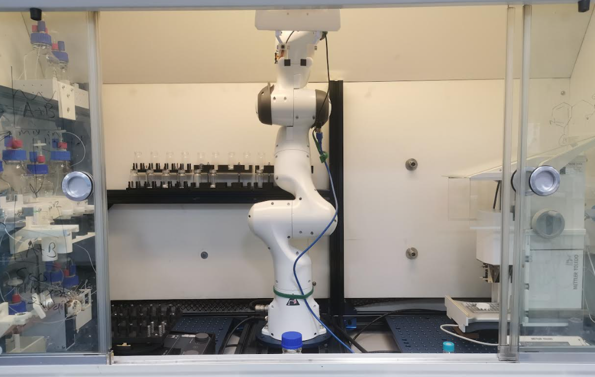

## Launching real-time kernel

In the boot menu, select  Advanced options for Ubuntu.

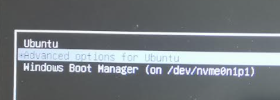

In the new menu, select 5.9.1-rt20. This is necessary for the computer to control the Panda robot.

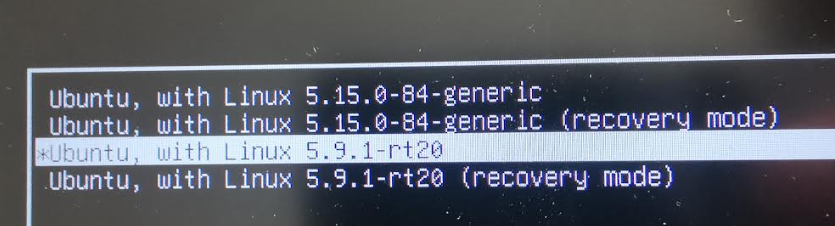

To verify that the correct kernel was selected,  type: 
```  
uname -r
```
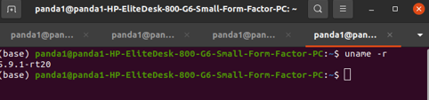

## Panda robot

Turn on the switch of the station.

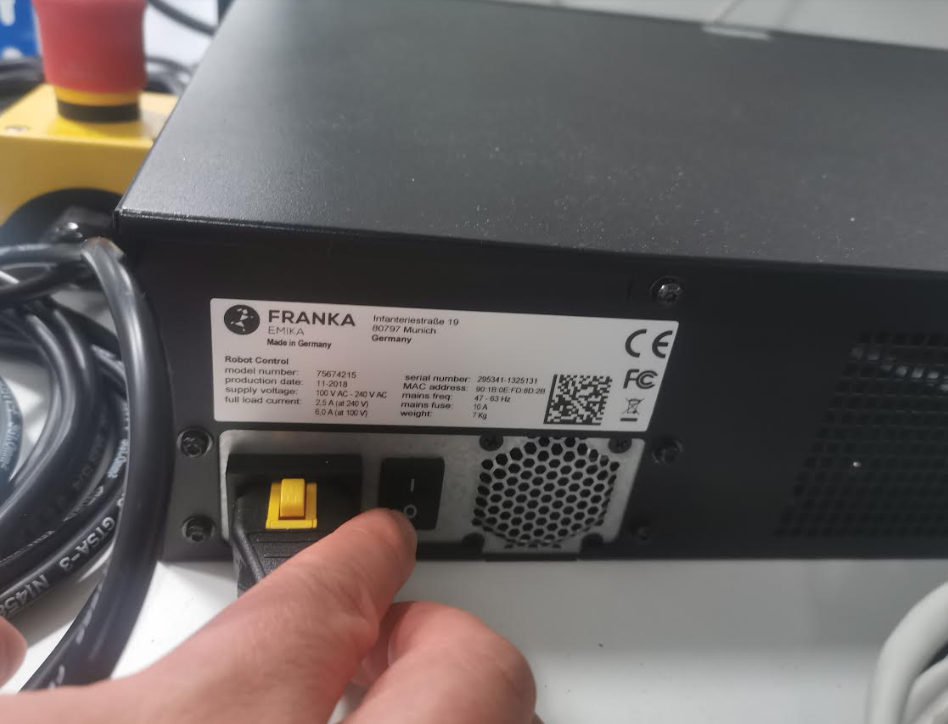

Open a browser, and go to "HTTP://172.16.0.2" in a new tab.

Click the unlock button and then click Open.

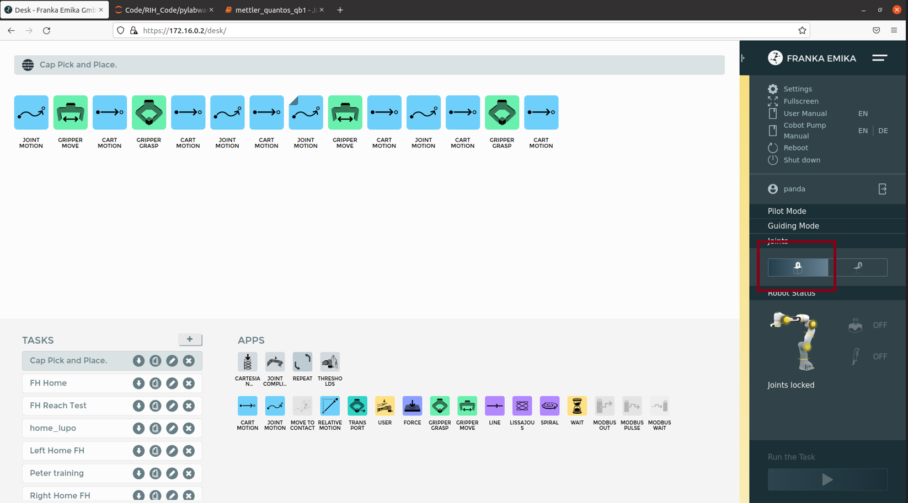

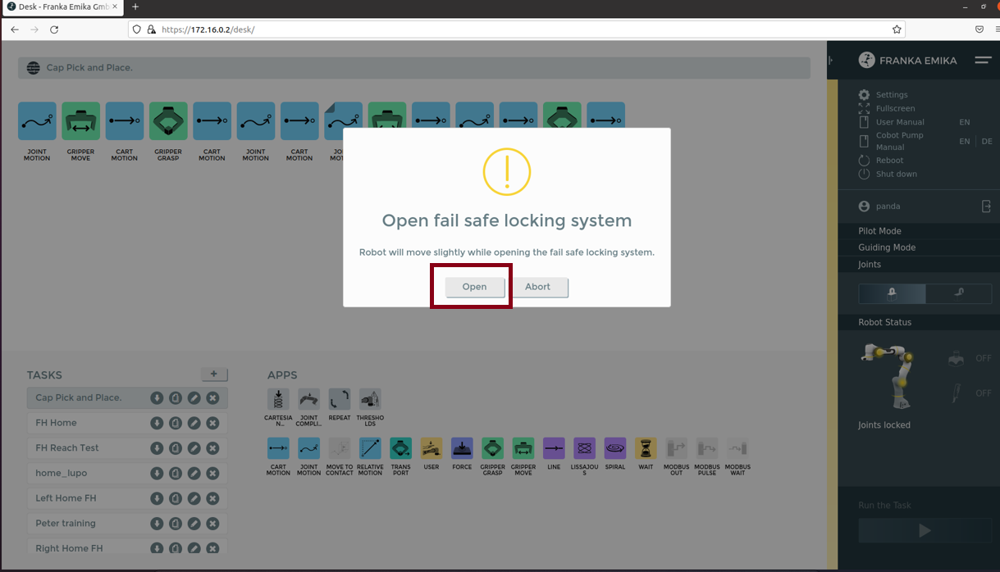

Once the robot breaks have been unlocked, the robot's light will change to purple if the emergency button is active and to blue if the emergency button is unpressed.  

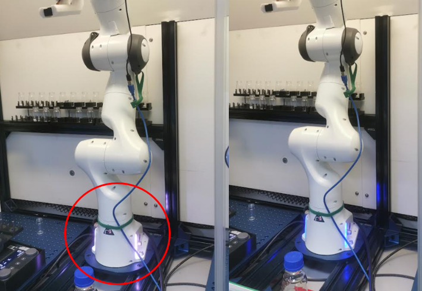

Emergency stop button:

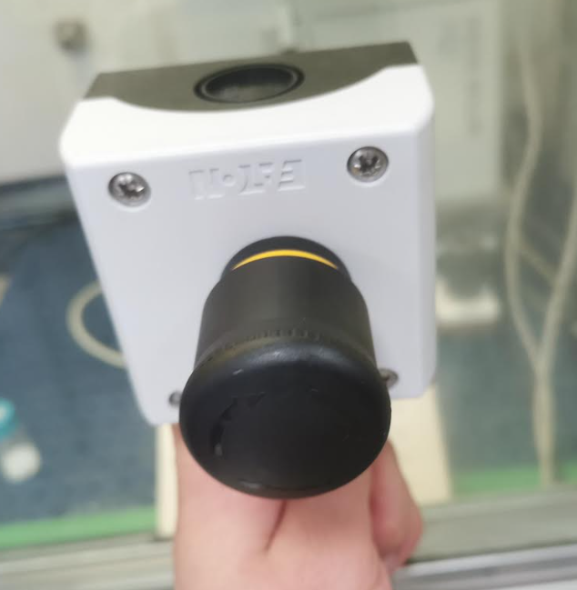

To turn off the robot, it is necessary first to click the lock button. 
Then, click the shutdown button and click Yes. Finally, wait until a pop-up window indicates that it is safe to turn off the system.

## Setting up a working environment

Open a terminal and navigate to the RobInHood directory with the following:

```
cd ~\RobinHoodPy
code .
``` 

From the menu, click on terminal and then click on New Terminal.

It is necessary to activate a conda environment. To do so, type:

```conda activate robostackenv38```

Open main.py

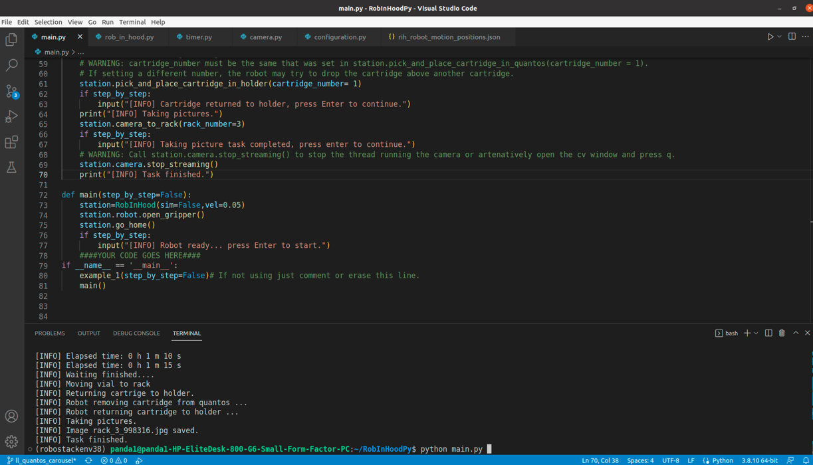

## Manipulating vials

The current setup supports the storage of up to 22 vials. The robot can take the vial to the vial holder of the xCalibur pump, the plate of the IKA station, the Quantos station, and the other way around for all the cases.

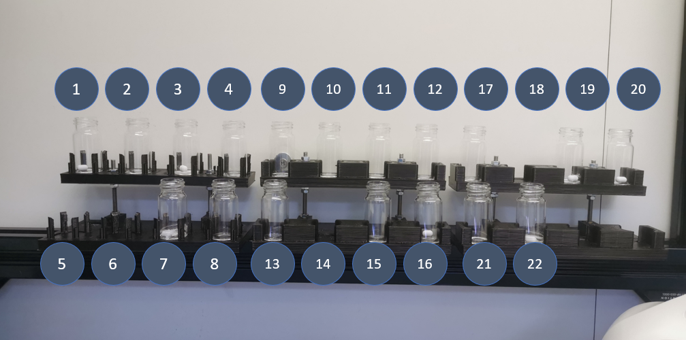

These are some of the instructions that can be executed:

```
station.vial_rack_to_quantos(vial_number=1)
station.vial_rack_to_ika(vial_number=9, ika_slot_number=5)
station.vial_ika_to_rack(ika_slot_number=6, vial_number=22)
```

## Mounting Cartridges in Quantos Mettler

Currently, the setup supports up to three cartridges. 

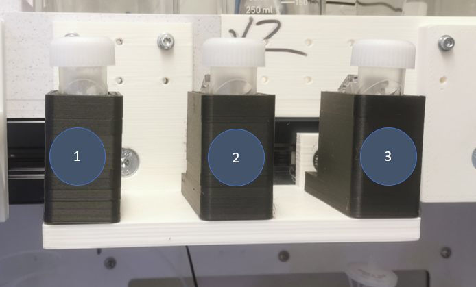

These are some of the instructions that can be executed:

```
station.pick_and_place_cartridge_in_quantos(cartridge_number = 1)
```

```
station.quantos_dosing(quantity=10)
```

```
station.pick_and_place_cartridge_in_holder(cartridge_number= 1)
```

## Putting vials on  the IKA station plate

The IKA station place can contain up to 12 vials.

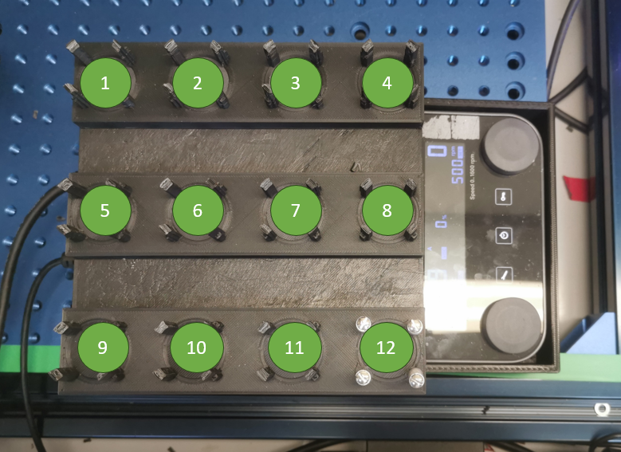

These are some of the instructions that can be executed: 

```
station.ika.start_stirring()
station.timer.set_timer(hours=0,min=1, sec=15)
station.timer.start_timer()
station.ika.stop_stirring()
```

## xCalibur Pump

The inputs and outputs of the xCalibur pump are as follows:

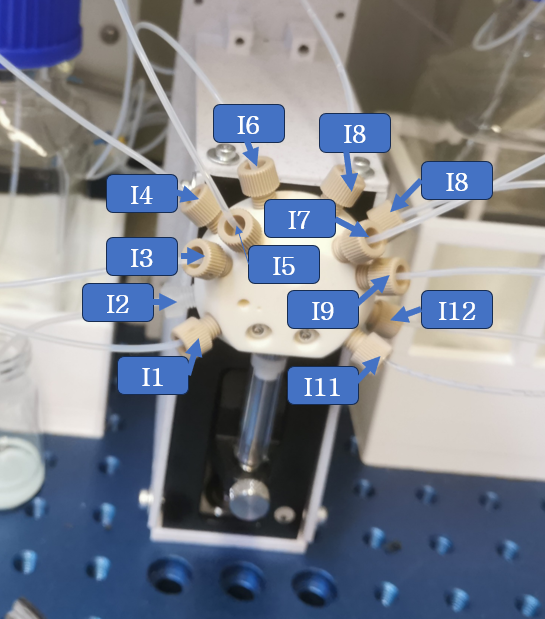

Before launching a program, make sure that the holder is in the following position: 

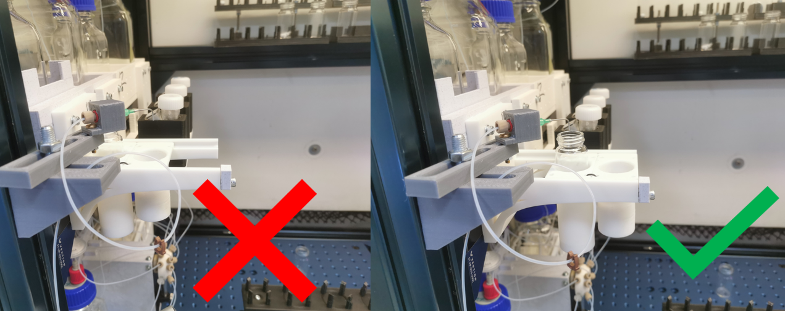


These are some of the instructions that can be executed: 
```
station.push_pump()
station.pump_inyect(input_source="I3",output="I2",quantity=2000,repeat=2)
station.pump_inyect(input_source="I3",output="I1",quantity=2000,repeat=2)
station.pull_pump()
```

## Saving Pictures of the vials

The robot can take pictures of the racks, which are enumerated from 1 to 3 as follows:

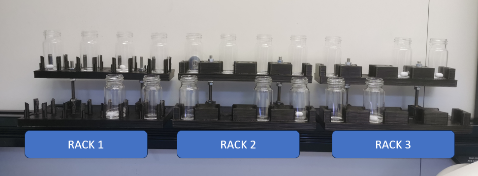

Photo taken with the camera of the robot:

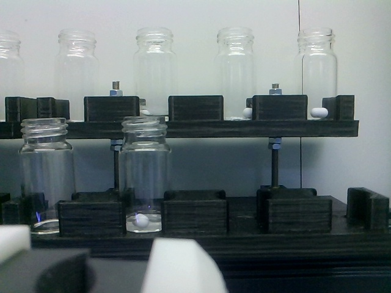

These are some of the instructions that can be executed:

```
station.camera_to_rack(rack_number=3)
station.camera_to_rack_photos_on_the_way()
```

## Running Example 1

This example aims to serve as a tutorial. If running ```python main.py```, the following routine will be executed:

 1. The robot picks cartridge 1 and puts it into quantos.
 2. The robot picks vial 1 and puts it into quantos.
 3. The quantos station doses 10 mg of the content in cartridge 1 into the vial.
 4. The robot moves the vial to the pump dispenser.
 5. The robot moves the vial to the IKA station.
 6. The IKA station starts stirring for 1 min 15 s.
 7. The robot takes the vial from the slot number 6 and places it into the slot number 22, which is in rack 3.
 8. The robot removes the cartridge from quantos and returns it to cartridge holder 1.
 9. The robot takes a picture of rack 3 and saves it in ...\\RobInHoodPy\\imgs\\.


[](https://www.youtube.com/watch?v=rQPUJDlCGj4)


# Documentation

Further details and descriptions of the classes and their methods can be found at RobInHoodPy/docs/_build/html/index.html

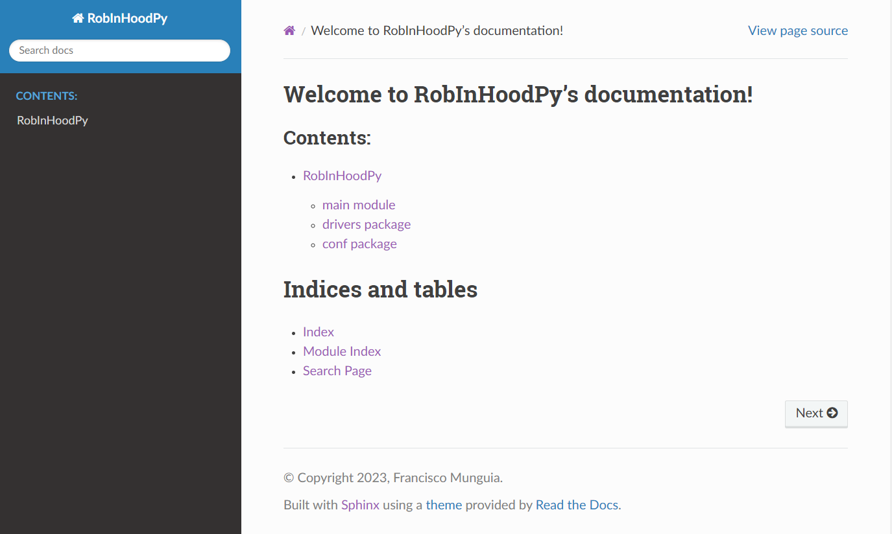


